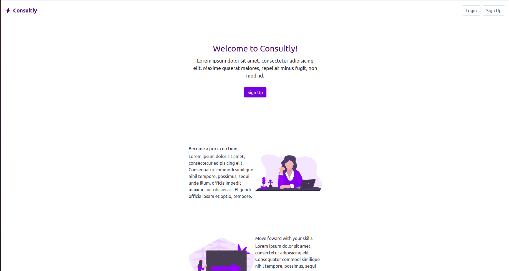
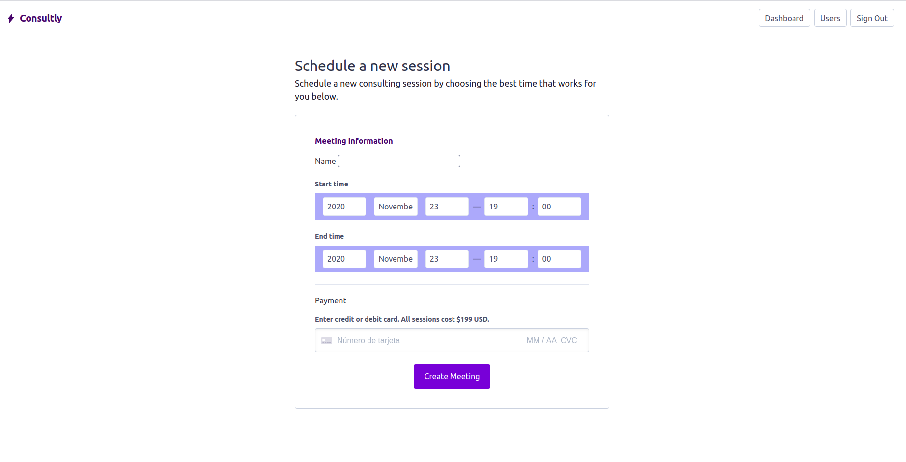
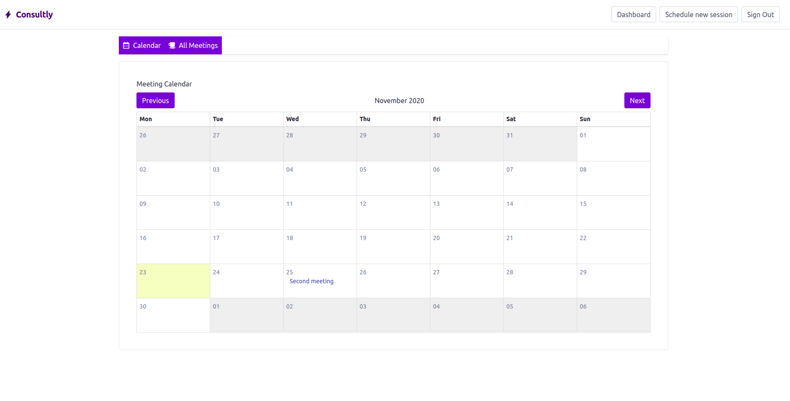
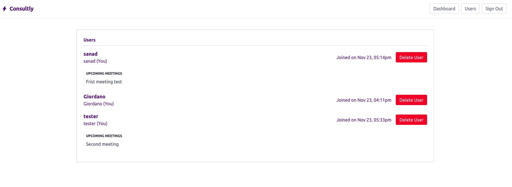

# 🧐 Consultly!! Private project

> A meeting app building with Ruby on Rails



## :notebook: Concept

> Build a basic app with rails to learn the basic concepts of users expirience with devise gem, and for the styles was used Tailwindcss, It consist of making a meeting app where you can use a calendar (simple_calendar gem) to create and show your meetings and Add a payment form for this meetings, also there are a admin user to controll your app and users behavior and finally you can Respond your assitants with a mail, using mailer option from rails.

> View to create a new meeting in your account.



> View to see all your meetings in the month.



> View like admin and admin accounts.



## 🛠 Built With

- Ruby on Rails
- Tailwindcss
- Postgresql
- Mailers
- Stirpe payment


## 🔧 Getting Started

> To get a local copy up and running follow these simple example steps.

- Go to the main page of the repo.
- Press the "Code" button and get the repo link.
- Clone it using git clone.

### 📝 Prerequisites

- Ruby -v2.7.0p0
- Rails -v6.0.3.3

### 📝 Setup

 - Open a terminal
 - Copy this code : 

        ```
        git clone "put the link from github repo"
        ```

 - Run the program with this code :

        ```
        bundle install
        ```       

- Run the program with this code :

        ```
        rails db:create
        rails db:migrate
        ```

- before running ```rails server``` you must run a few more commands: first run ```yarn install --check-files```,
```rails generate devise:install``` then you can configure the Devise gem.
- now you can run ```rails server```
- Stop the program with: "Ctrl + C" (Windows or Linux) or "Command + C"(Apple)

### 📝 How to interact with the app?

- When the program is running go to your browser

- put: localhost:3000/

- Click on login, register and create a new article

- Enjoy the app.

### Usage

- Personal Project - Create a basic blog app just with learning purpose

## 👤 Authors

👤 **Giordano Díaz**

- Github: [@diazgio](https://github.com/diazgio)
- Twitter: [@giordano_diaz](https://twitter.com/giordano_diaz)
- LinkenIn:[LinkenIn](www.linkedin.com/in/Giordano-Diaz)

## 🤝 Contributing

Contributions, issues and feature requests are welcome!

Feel free to check the [issues page](issues/).

## Show your support

Give a ⭐️ if you like this project!

## Acknowledgments

- Hat tip to anyone whose code was used
- Inspiration
- etc

## 📝 License

This project is [MIT](LICENSE) licensed.
